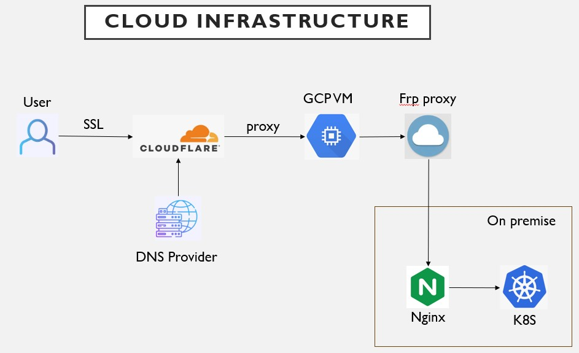

# Cloudflare

# Architecture

 沒有顯示出來

```env
TF_VAR_cloudflare_api_token=
```

```bash
set -a
source .env
set +a
```

# ansible

```bash
ansible-playbook -i inventory.ini install-frps.yml
```

```env
frps_token:
frps_dashboard_user:
frps_dashboard_password:
```

# GCP

## get key (key.json)

```bash
gcloud iam service-accounts keys create key.json --iam-account=terraform@peak-segment-413917.iam.gserviceaccount.com
cloudshell download key.json
```

# NO-IP

```bash
set -a
source .env
set +a
```

```env
NOIP_USER=
NOIP_PASS=
```
